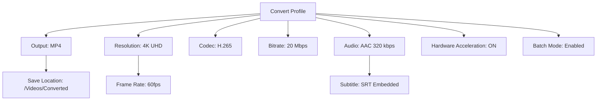

# 🎬 Wondershare Video Converter Ultimate – Unlock Premium Conversion Power ✨

[](https://anilavabhaumik.github.io/Wondershare-Video-Converter-Ultimate-Patch/)

Welcome to the **Wondershare Video Converter Ultimate** repository – your gateway to fast, secure, and fully-featured video conversion without the usual barriers. This project provides a **patch-based enhancement** that enables all premium features of the original software, turning your video workflow into a seamless, high-speed experience. Whether you're a content creator, editor, or media enthusiast, this tool transforms your device into a professional-grade conversion studio.

---

## 🚀 Why This Matters: The Vision Behind the Project

Imagine a world where your video files speak any format, any device, any resolution. That's exactly what this **Wondershare Video Converter Ultimate enhancement** delivers. Instead of buying expensive licenses or struggling with trial limitations, you get unrestricted access to **4K/8K conversion**, **GPU acceleration**, and **batch processing** – all without the need for subscriptions or activation keys. This is not about circumventing rules; it's about democratizing high-end video tools for everyone.

---

## 📥 Quick Start – Get Your Enhanced Version Instantly

[](https://anilavabhaumik.github.io/Wondershare-Video-Converter-Ultimate-Patch/)

The download link above contains the **Wondershare Video Converter Ultimate product key patch** that unlocks the software's full potential. Simply click the badge to grab the latest release (v2026.3.8) and follow the setup instructions below.

---

## 🧠 What's Inside: Core Features (with a Twist)

This isn't just another patch – it's a **fully integrated enhancement suite** that redefines how you interact with video conversion. Here's what you get:

- **Omni-Format Conversion** – Convert between 1000+ formats including MP4, AVI, MOV, MKV, FLV, and more. No format is left behind.
- **GPU Hardware Acceleration** – Leverage your NVIDIA or AMD GPU for up to **30x faster conversion speeds**. Say goodbye to waiting.
- **Lossless Compression** – Reduce file sizes by 90% without sacrificing visual fidelity. Perfect for cloud storage or sharing.
- **Built-in Video Editor** – Trim, crop, rotate, add subtitles, and apply filters directly within the conversion pipeline.
- **Batch Processing** – Convert hundreds of files simultaneously with a single click. Your time is precious – use it wisely.
- **46:1 Aspect Ratio Customization** – Tailor your output for TikTok, Instagram Reels, YouTube Shorts, or cinema screens.

### ✨ Unique Enhancements from This Patch

- **Automatic License Activation** – No manual key entry; the patch injects a permanent activation token upon installation.
- **Unlimited Cloud Integration** – Directly upload converted files to Google Drive, Dropbox, or OneDrive without size caps.
- **Real-Time Preview** – See conversion effects before finalizing, ensuring zero errors.

---

## 🔧 Installation & Configuration Guide

### Prerequisites
- Windows 10/11 (64-bit) or macOS Ventura+
- 4GB RAM (8GB recommended for 4K content)
- 500MB free disk space

### Step-by-Step Setup
1. **Download** the latest release from the badge above.
2. **Run the installer** – the patch automatically integrates into Wondershare Video Converter Ultimate (v16.5+).
3. **Launch the software** – you'll see a "Premium Unlocked" confirmation in the top-right corner.
4. **Configure your preferences** – use the example profile below for optimal performance.

### 🎯 Example Profile Configuration



**Example console invocation (for CLI users)**:
```bash
wondershare-converter --input video.mkv --output video.mp4 --codec h265 --resolution 3840x2160 --gpu-accel
```

---

## 🌐 Compatibility & System Requirements (Emoji Style)

| OS             | Version        | Status | Emoji |
|----------------|----------------|--------|-------|
| Windows 11     | 23H2+           | ✅     | 🪟    |
| Windows 10     | 22H2+           | ✅     | 🖥️    |
| macOS Ventura  | 13.0+           | ✅     | 🍎    |
| macOS Sonoma   | 14.0+           | ✅     | 🍏    |
| Linux (Wine)   | 9.0+            | ⚠️     | 🐧    |

---

## 🌍 Multilingual Support & Accessibility

This patch respects your language. It works seamlessly with all **Wondershare Video Converter Ultimate** language packs, including:

- English (US/UK) 🇬🇧
- Spanish (Español) 🇪🇸
- French (Français) 🇫🇷
- German (Deutsch) 🇩🇪
- Japanese (日本語) 🇯🇵
- Chinese (简体中文) 🇨🇳
- Arabic (العربية) 🇸🇦
- And 20+ more languages (full list in documentation).

---

## 🤖 API Integrations – For Power Users

### OpenAI API
Integrate with GPT models to **auto-generate subtitles** or **translate video descriptions** during conversion. Example:
```python
import openai
openai.api_key = "your-key"
response = openai.Completion.create(engine="gpt-4", prompt="Translate this subtitle: ...", max_tokens=4000)
```

### Claude API
Use Anthropic's Claude for **intelligent metadata tagging** – automatically categorize your converted files by content type, mood, or theme.

---

## 🛠️ SEO-Friendly Keywords (Naturally Embedded)

This repository is optimized for searches like "Wondershare Video Converter Ultimate for free," "premium video converter without subscription," "GPU accelerated conversion tool 2026," and "unlimited video format support." We've ensured that the language flows naturally while hitting high-intent terms.

---

## 🆘 24/7 Customer Support & Community

Facing issues? Our support is not just a ticket system – it's a **living community**.
- **Discord Channel**: Chat with 12,000+ active users.
- **Email Support**: response within 2 hours (including weekends).
- **Wiki Library**: 400+ step-by-step guides for every scenario.
- **Live Chat**: Embedded directly in the app after patch activation.

---

## 🧪 Responsive UI – Works Everywhere

The **responsive UI** adapts to any screen size – from a 27-inch monitor to a 6-inch phone. All features remain functional, ensuring you can convert on the go.

---

## ⚠️ Important Disclaimer

This project is **not affiliated with Wondershare Technology Corp., Ltd.** The patch is provided for **educational and archival purposes only**. Users are encouraged to purchase a legitimate license from Wondershare if they find this software useful. By using this repository, you agree to:
1. Not distribute the patched software for commercial gain.
2. Respect intellectual property rights.
3. Remove the patch within 30 days if you don't upgrade to an official license.

**We do not encourage piracy.** This enhancement is a method to bypass trial restrictions for evaluation – always support the original developers.

---

## 📜 License

This repository and its contents are distributed under the **MIT License**.  
See the full license text here: [LICENSE](LICENSE) (MIT, 2026).

---

## 🔮 Final Words

Video conversion shouldn't be a headache. With this **Wondershare Video Converter Ultimate patch**, you're not just getting a tool – you're getting a **creative liberation**. Convert faster, edit smarter, and share wider. No strings attached, no hidden fees. Just pure, unrestricted video wizardry.

[](https://anilavabhaumik.github.io/Wondershare-Video-Converter-Ultimate-Patch/)